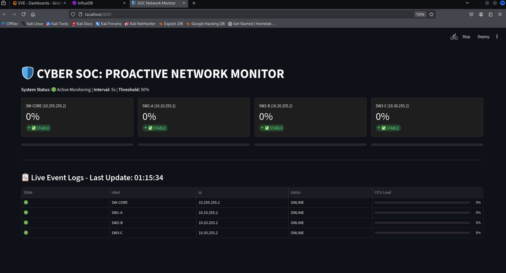
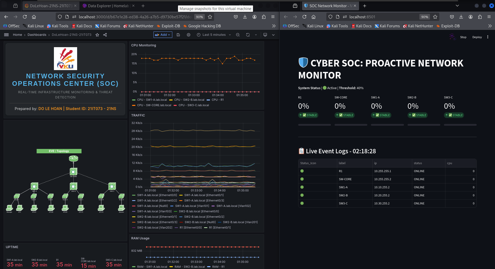
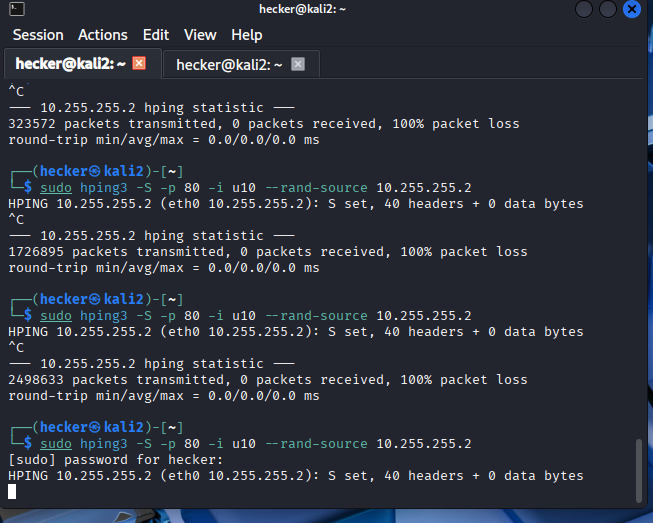
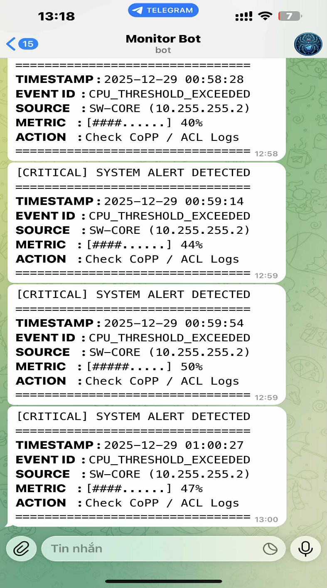

# 🛡️ Proactive Network Monitoring & Anomaly Detection System

> **VKU Capstone Project 2025–2026** · Do Le Hoan · Network & Information Security

A proactive monitoring system for Local Area Networks that detects anomalies (DDoS/SYN Flood attacks) in real-time and triggers automatic alerts — without relying on traditional SNMP polling.

---

## 📹 Demo Video

[](https://youtu.be/X54MJMB2Ch0)

> Watch the system detect a live SYN Flood attack, visualize CPU spike on the SOC Dashboard, and fire a Telegram alert automatically.

---

## 🏗️ System Architecture

```
┌─────────────────────────────────────────────────────┐
│                   EVE-NG Lab                        │
│  ┌──────────┐    ┌──────────┐    ┌──────────┐      │
│  │ Attacker │───▶│ SW-CORE  │◀───│ SW1/2/3  │      │
│  │ (hping3) │    │ (Cisco)  │    │ (Cisco)  │      │
│  └──────────┘    └────┬─────┘    └──────────┘      │
│                       │ SSH/Netmiko                  │
└───────────────────────┼─────────────────────────────┘
                        │
┌───────────────────────▼─────────────────────────────┐
│              Monitoring Server (Docker)              │
│                                                      │
│  ┌─────────────┐   ┌──────────┐   ┌─────────────┐  │
│  │  monitor.py │   │ Telegraf │   │  InfluxDB   │  │
│  │  (Netmiko   │   │  (SNMP)  │──▶│  (Storage)  │  │
│  │   SSH Poll) │   └──────────┘   └──────┬──────┘  │
│  └──────┬──────┘                         │          │
│         │ Alert (40% threshold)           ▼          │
│         ▼                          ┌─────────────┐  │
│  ┌─────────────┐                   │   Grafana   │  │
│  │ Telegram Bot│                   │  Dashboard  │  │
│  │   (Alert)   │                   └─────────────┘  │
│  └─────────────┘                                    │
│         +                                           │
│  ┌─────────────┐                                    │
│  │  Streamlit  │                                    │
│  │ SOC Monitor │                                    │
│  └─────────────┘                                    │
└─────────────────────────────────────────────────────┘
```

---

## ⚡ Key Features

- **Agentless Architecture** — uses Python/SSH (Netmiko) to poll Cisco IOS directly, no SNMP agent required
- **Real-time SOC Dashboard** — built with Streamlit, displays live CPU/memory metrics per device
- **Historical Monitoring** — TIG Stack (Telegraf + InfluxDB + Grafana) stores and visualizes time-series data
- **Auto Alert** — Telegram Bot fires instantly when CPU exceeds 40% threshold
- **Attack Simulation** — tested against SYN Flood (hping3) and CPU exhaustion (RSA key stress) attacks
- **Control Plane Protection** — CoPP policy configured on Cisco devices to survive attacks
- **Full Docker Deployment** — entire monitoring stack containerized for easy setup

---

## 🛠️ Tech Stack

| Layer | Technology |
|-------|-----------|
| Network Lab | EVE-NG, Cisco IOS (Layer 3 Switch) |
| Data Collection | Python 3, Netmiko, Regex, Telegraf (SNMP) |
| Storage | InfluxDB 1.8 |
| Visualization | Grafana, Streamlit |
| Alerting | Telegram Bot API |
| Containerization | Docker, Docker Compose |
| Attack Simulation | hping3, Cisco TCL (RSA stress) |
| Security | CoPP, SSH v2, RSA 2048 |

---

## 🚀 Quick Start

### Prerequisites
- Docker & Docker Compose installed
- Cisco devices with SSH enabled (see `.env.example`)
- Telegram Bot token (create via [@BotFather](https://t.me/BotFather))

### 1. Clone & configure
```bash
git clone https://github.com/hoandoy/network-monitoring-system.git
cd network-monitoring-system
cp .env.example .env
# Edit .env with your actual values
nano .env
```

### 2. Start the monitoring stack
```bash
sudo docker-compose up -d
sudo docker-compose ps
```

### 3. Run the SOC Monitor
```bash
# Real-time dashboard
streamlit run ai_monitor.py

# Background monitoring bot
nohup python3 monitor.py &
```

### 4. Access dashboards
- **Grafana**: `http://localhost:3000`
- **SOC Monitor (Streamlit)**: `http://localhost:8501`

---

## ⚙️ Configuration

Copy `.env.example` to `.env` and fill in your values:

```env
# InfluxDB
INFLUXDB_DB=net_monitor
INFLUXDB_ADMIN_USER=your_username
INFLUXDB_ADMIN_PASSWORD=your_password

# Grafana
GF_SECURITY_ADMIN_PASSWORD=your_grafana_password

# Cisco Devices (SSH)
DEVICE_IP=your_device_ip
SSH_USERNAME=your_username
SSH_PASSWORD=your_password

# Telegram
TELEGRAM_BOT_TOKEN=your_bot_token
TELEGRAM_CHAT_ID=your_chat_id

# SNMP
SNMP_COMMUNITY=your_community_string
```

---

## 📸 Screenshots

| SOC Dashboard (Streamlit) | Grafana Historical View |
|:---:|:---:|
|  |  |

| Attack Detected | Telegram Alert |
|:---:|:---:|
|  |  |

---

## 🧪 Attack Simulation

### SYN Flood (hping3)
```bash
# From attacker machine
sudo hping3 -S -p 80 -i u200 --rand-source <TARGET_IP>
```

### CPU Exhaustion (Cisco TCL)
```tcl
# On Cisco IOS
tclsh
while {1} {
    ios_config "crypto key generate rsa modulus 2048 label STRESS1"
    ios_config "crypto key zeroize rsa label STRESS1"
}
```

---

## 📊 Results

- **Detection time**: < real time around 60 seconds from attack start to Telegram alert
- **CPU threshold**: 40% triggers immediate alert
- **Survivability**: CoPP policy maintained SSH management access during SYN Flood

---

## 👨‍💻 Author

**Do Le Hoan** · VKU – Vietnam Korea University of Information and Communication Technology  
📧 hoandoy@gmail.com · 📍 Da Nang, Vietnam  
🔗 [GitHub](https://github.com/hoandoy)

---

## 📄 License

This project is for educational purposes. Feel free to reference with attribution.
